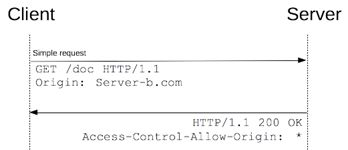

# Basic Application Security

In this article, I will be showing some common attacks and how to protect your applications against them.

> It was create to stress some of the basic security implementations applications should enforce.

## Enforcing SSL

Sites which process sensitive data should always use SSL, mostly of the 'secure' web-sites redirects their HTTP request to HTTPS. Below is a ```pseudocode``` explaining how to achieve it.

```c: 
    // Request Pipeline Middleware Algorithm
    start
        define function to verify request => f(x), x = HttpContext

        if x.Request url scheme is not HTTPS
            attribute and change the request url scheme to HTTPS to var newUrl
            redirect x.Response to newUrl
    end
```

The very first request even using SSL is not encrypted, a man-in-the-middle could forgery this very first request to his own version of the application to gather sensitive data from users. So some techniques have to be applied to secure the communication between the client and your application *(see HSTS section)*.

## Common Attacks and Solutions

### HTTP Strict Transport Security - HSTS

To avoid a man-in-the-middle providing his own version of your application, you should add a (STS) HTTP header to your responses.

The *STS* header will add your WebApp to an internal list in the browser accessing it and the browser will not allow future access to your WebApp in an insecure manner.

```html: 
    Strict-Transport-Security: max-age=31536000
```

Adding the header above will restrict insecure access to your WebApp for 31536000 seconds (1 year).

> Note that once you've done it, there is no way back and your WebApp will only be accessible through HTTPS.

To disable it you'll have to set the header as follow, ```Strict-Transport-Security: max-age=0```

Another important technique for avoiding that very first insecure requests is to add your domain to a HSTS preload list which mostly of modern browsers support.

Once you've added your WebApp domain to (HSTS preload list)[https://hstspreload.org]. Any future release of those supported browsers will contain your domain in their internal list of secure domains and any communication to that domain will only go through HTTPS.

#### Browser Support

 - Edge & Internet Explorer 11 on Windows 8.1 and Windows 7[2]
 - Firefox 4 +
 - Opera 12 +
 - Safari Mavericks (Mac OS X 10.9) +
 - Chrome 4.0.211.0 +

#### Frameworks

 - NWebsec.Mvc (ASP.NET)
 - helmetjs (NodeJs)
 - pyramid_hsts (Python)

#### References

 - https://hstspreload.org/
 - https://www.owasp.org/index.php/HTTP_Strict_Transport_Security_Cheat_Sheet

------------------------------------------------------------------------------------------------

### Cross Site Scripting (XSS)

XSS is when attackers places JavaScript code into your application. 

> It usually happens when applications provides data input forms with no input validation and those inputs are shown somewhere else in the application.

To avoid it, any input provided should be encoded. Depending on the framework your application is using, it will provide helpers to encode inputs or the outputs.

#### Samples

JavaScript:

```js: 
    var data = "<script>alert('Hello World!');<\/script>";
    var newData = escape(data); // encodeURI(data);

    document.write(newData); // => %3Cscript%3Ealert('Hello%20World!');%3C/script%3E
```

C# & .NET Core - ASP.NET MVC:

```c: 
    private readonly IHtmlGenerator _htmlGenerator;
    public HomeController(IHtmlGenerator htmlGenerator) 
        => _htmlGenerator = htmlGenerator ?? throw new ArgumentNullException(nameof(htmlGenerator));

    public IActionResult Index()
    {
        ViewBag.Data = @"<script>alert('Hello World!');</script>";
        ViewBag.Encoded = _htmlGenerator.Encode(ViewBag.Data);
        ViewBag.HtmlData = new HtmlString(ViewBag.Data);

        return View();
    }

    // View Index.cshtml
    @ViewBag.HtmlData // => executes the script
    @Html.Raw(@ViewBag.Data) // => executes the script
    @ViewBag.Encoded // show text => &lt;script&gt;alert(&#x27;Hello World!&#x27;);&lt;/script&gt;
    @Html.Raw(@ViewBag.Encoded) // show text => <script>alert('Hello World!');</script>
```

> See also [XSS.html](./quickstarts/XSS-and-CSP/XSS.html) sample

------------------------------------------------------------------------------------------------

### Content Security Policy (CSP)

CSP comes in to tackle a browser behavior of executing inline or external scripts. Simple by adding a HTTP header ```Content-Security-Policy: script-src 'self'``` will disable loading and execution of external or inline JavaScript. It cannot be used only for loading JavaScript but many other content-types as per below:

 - script-src
 - style-src
 - img-src
 - media-src
 - frame-src
 - font-src
 - default-src (general configuration for all above)

#### Samples

Script-src:

```: 
    // Allows loading JavaScript from current domain plus anything from *.domainsample.com
    Content-Security-Policy: script-src 'self' *.domainsample.com

    // Allows loading CSS resources from current domain only
    Content-Security-Policy: style-src 'self'

    // Disallow loading Frames
    Content-Security-Policy: frame-src 'none'
```

> See also [CSP.html](./quickstarts/XSS-and-CSP/CSP.html) sample

#### References

 - [https://content-security-policy.com/](https://content-security-policy.com/)
 - [https://www.owasp.org/index.php/Content_Security_Policy_Cheat_Sheet](https://www.owasp.org/index.php/Content_Security_Policy_Cheat_Sheet)

------------------------------------------------------------------------------------------------

### Unvalidated Redirect & Forwards / Open Redirect Attacks

Unvalidated Redirect & Forwards attacks happens when attacker discover redirect mechanisms in WebApps which redirects requests based on a query-string value provided.

Sample:

```:
    https://somebank.ie/?returnUrl=http://somebank.net/
```

> To secure your WebApp against it, just configure the redirect mechanism to validate the query-string URL using a domain white-list. Some frameworks have helpers to validate local URLs.

------------------------------------------------------------------------------------------------

### Cross Site Request Forgery

CSRF attackers creates fake forms of for example an marketing campaigns page with inviting messages as 'You have won $1000!' however these forms contains hidden fields action post to the victim bank transfer money form. Them the victim subscribes to that fake campaign, the form actually transfer money from the victim.

> It's a simple example, but it could happen with any other action, normally the attackers knows the victim has access to specific apps and areas into those apps and they use the victim app access to do operations on behalf that user.

```html: 
    // Fake form
    <h1>You have won $1000!</h1>
    <form action="https://somebank.ie/api/transfer" method="post">
        <input type="hidden" name="Amount" value="100000" />
        <input type="hidden" name="AccountNumber" value="ATK3R489456646465465" />
        <input type="submit" value="Click here to redeem!" />
    </form>
```

#### Clicking-jacking

Clicking-jacking attacks are very related to CSRF attacks as attacker send users to their fake pages with buttons like 'You have won $100' or some inviting message, so then users when clicking on these links, they're actually triggering a post through a hidden button/form into a iframe hosted in the attackers website.

> This post could be to their bank transfer money form which will transfer their money (as the victim may still be logged on) to someone else.

By settings some of the HTTP headers below, you now controls how and who can load your page into iframes.

```: 
    X-Frame-Options: DENY
    X-Frame-Options: SAMEORIGIN
    X-Frame-Options: ALLOW-FROM https://yourdomain.com
    X-Frame-Options: ALLOW-FROM https://*.yourdomain.com
```

> Image below could be in the webpage and once clicked it would trigger an script execution without the end-user consent.


------------------------------------------------------------------------------------------------

### SQL Injection

SQL Injection are attacks wherein an attacker can execute malicious SQL statements.

> See also [SQLInjection Quickstart](./quickstarts/SQLInjection) C# sample

```c: 
    public IActionResult Product(string value)
    {
        var query = $"select * from [DataEntry] where [Name] = '{value}'";

        // executes command with above query without validate the input
        // . . .
    }
```

Some examples of SQL Injection statements are:

```c:
    // Expose all entries on table
    ' OR 1=1 --

    // Executes destructive operation
    gone'; DROP TABLE [DataEntry]

    // Executes ultimate destructive operation
    '; BEGIN TRY DROP TABLE #TempEvil; END TRY BEGIN CATCH END CATCH; SELECT [name] INTO #TempEvil FROM [sys].[databases] WHERE [name] = 'SqlInjection'; DECLARE @counter INT; DECLARE @au_id CHAR(55); SET @counter = 1; SELECT @au_id = min([name]) FROM #TempEvil; WHILE @counter <= 1 BEGIN EXEC('ALTER DATABASE ' + @au_id + ' SET OFFLINE WITH ROLLBACK IMMEDIATE; DROP DATABASE ' + @au_id + ';'); SET @counter = 2; END; --

    // Beautify
    BEGIN TRY DROP TABLE #TempEvil; END TRY BEGIN CATCH END CATCH;

    SELECT 
        [name]
    INTO #TempEvil
    FROM sys.[databases]
    WHERE [name] = 'SqlInjection'

    DECLARE @counter INT;
    DECLARE @au_id CHAR(55);

    SET @counter = 1;
    SELECT @au_id = min([name]) FROM #TempEvil;

    WHILE @counter <= 1--@au_id IS NOT NULL
    BEGIN
        EXEC('ALTER DATABASE ' + @au_id + ' SET OFFLINE WITH ROLLBACK IMMEDIATE; DROP DATABASE ' + @au_id + ';');
        SET @counter = 2;

        --ALTER DATABASE [SqlInjection];
        --SET OFFLINE WITH ROLLBACK IMMEDIATE;
        --DROP DATABASE [SqlInjection];
        --SELECT * FROM #TempEvil WHERE [name] = @au_id
        --SELECT @au_id = min([name]) FROM #TempEvil WHERE [name] > @au_id
    END;
```

### How to secure your app against it:

 - Validate Inputs
 - Last privilege account (specific grant access)
 - ORM (Object Relational Mapper)
   - Entity Framework
   - Nhibernate
   - Django ORM

> WARN: ORMs can be vulnerable when working with Store-Procedures.

#### References

- [SQL Injection Cheat Sheet](https://www.netsparker.com/blog/web-security/sql-injection-cheat-sheet/)
- [Why is SQL Injection...](https://security.stackexchange.com/questions/128412/sql-injection-is-17-years-old-why-is-it-still-around)

------------------------------------------------------------------------------------------------

### Cross Origin Resource Sharing - CORS

It is a browser mechanism which restrict (cross domain) resource requests.

**Request**
```c: 
    Access-Control-Request-Method: POST 
    Access-Control-Request-Headers: X-PINGOTHER, Content-Type
```

**Response**
```c: 
    Access-Control-Allow-Origin: *.asaviecdn.com
    Access-Control-Allow-Methods: POST, GET, OPTIONS 
    Access-Control-Allow-Headers: X-PINGOTHER, Content-Type
```



#### References

 - [https://developer.mozilla.org/en-US/docs/Web/HTTP/Access_control_CORS](https://developer.mozilla.org/en-US/docs/Web/HTTP/Access_control_CORS)

------------------------------------------------------------------------------------------------

## References

- [ASP.NET - Common Attacks](https://app.pluralsight.com/player?course=asp-dot-net-core-security-understanding&author=roland-guijt&name=c34a5efc-a275-4675-bc0d-495aefb5ed1a&clip=0&mode=live)
- [What Every Developer Must Know About HTTPS](https://app.pluralsight.com/library/courses/https-every-developer-must-know/table-of-contents)
- [OWASP](https://www.owasp.org/index.php)
  - [OWASP List](https://www.owasp.org/index.php/Category:OWASP_Top_Ten_Project#OWASP_Top_10_for_2013)
  - [OWASP Attacks](https://www.owasp.org/index.php/Category:Attack)